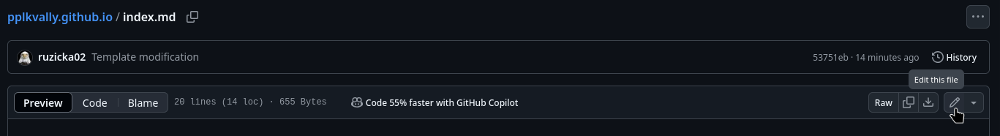
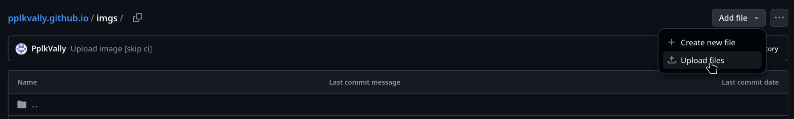
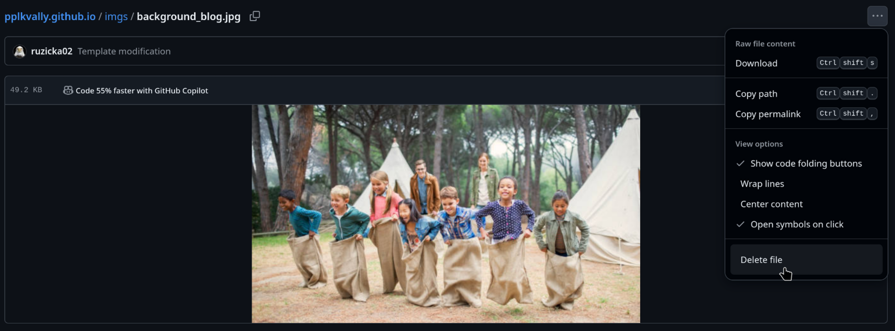

# Jak upravovat tenhle web a nezešílet

Základní změny se dělají v konfiguračním souboru `_config.yml`:
- Jméno webu v patičce a jménech záložek
- odkazy v hlavičce a patičce webu
- odkaz na logo v hlavičce
- sekce "Příspěvky"

**Hlavní stránky webu** potom jsou:
- `index.md` Domovská stránka
- `about.md` O nás
- `404.md` Pro pokus o načtení neexistující stránky

Potom se dají vcelku intuitivně přidávat **nové příspěvky** z adresáře `_posts`.
Jméno souboru musí obsahovat datum zveřejnění, obecně jakékoliv datum v
minulosti.  Tyto příspěvky pak jsou seřazené podle data v záložce "Příspěvky".

Tenhle soubor `README.md` se na web nikdy nedostane, a bude jenom v tomhle
repozitáři, který je něco jako "portál pro správu webu". Každopádně, tenhle
repozitář musí být taky veřejný (pro nahlížení), takže bych sem nedával nic
tajného.

POZOR: Skrz tento "portál správce" na `github.com` je vidět i historie změn.
Pokud v jednom commitu něco přidám, a ve druhém odeberu, pořád se k tomu lze
dostat. Pokud v historii mám něco, co tam hodně nechci mít, vyhledám pomoc
někoho, kdo Gitu víc rozumí.

## Hlavička dokumentu

Každá ze stránek má svou **hlavičku**, která upravuje její podobu mimo samotný
obsah. Hlavička začíná a končí řádkou se sekvencí `---`. Vypadá nějak takhle:

```
---
title: Jméno stránky
feature_image: "/imgs/background_homepage.jpg"
feature_text: |
  ## Černý nadpis
  <h2 style="color: rgb(255, 255, 255)">Nadpis, kterému jde změnit barva</h2>
# indexable: false
---

Tady začíná obsah
```

Title se nezobrazí přímo na stránce, ale ve jméně záložky, a při sdílení na
sociální sítě. Je vhodné mít stejný text ještě jednou jako Feature text, nebo
jako první nadpis na stránce.

Feature image a Feature text je část s velkým obrázkem přes celou stránku, který
může (ale nemusí!) překrývat text. Text má ve výchozím stavu šedou barvu, která
s hromadou obrázků splyne. Pro nadpis jiné barvy použij druhý ze zmiňovaných
způsobů, kde jde zvolit barva pomocí RGB kódu.  RGB kód si můžeš najít třeba na
[HTML Color Picker](https://www.w3schools.com/colors/colors_picker.asp).

Fun fact: Tato hlavička fakticky není formátu Markdown, ale YAML (stejně jako
`_config.yml`). Proto jdou řádky zneplatnit zakomentováním, kdy se na začátek
přidá symbol `#`. V Markdownu by tohle udělalo nadpis. Textová hodnota parametru
v YAML formátu se píše buď na jeden řádek do "uvozovek", nebo na více řádek -
potom je potřeba na první řádku dát symbol `|`.

## Jak upravit obsah stránky?

Musíš být na stránce https://github.com/PplkVally/pplkvally.github.io,
přihlášený jako uživatel který má právo repozitář měnit. To může být vlastník
projektu (účet `PplkVally`), ale taky kdokoliv jiný, komu byly práva přiděleny.

Klikni na soubor, který chceš měnit, třeba `index.md`. Nelekni se, že
vykreslování dokumentu nebude moc fungovat - Github neočekává YAML hlavičku.
Vpravo nahoře je ikonka tužky `Edit this file`, viz screenshot.



Tím se web přepne do editačního módu, a Markdown se přestane vykreslovat.
Jakmile uděláš změny, které jsi chtěl, klikni na zelené `Commit Changes...`.
Tím se změny "uloží", v návaznosti se Github pokusí nasadit novou verzi webu,
což většinou trvá cca minutu. Pokud se něco pokazí, měla by zůstat veřejná
původní verze webu, pošle se notifikace mailem (něco ve smyslu **Pipeline
Failed/Broken**), a v dalším commitu můžeš chybu opravit.

Pokud chceš udělat commit (uložit změny), aniž by se nahrála nová verze na web,
je možné do jména/zprávy commitu přidat `[skip ci]` (CI = Continuous Integration).
Hodí se to zpravidla ve chvíli, když chci udělat více souvisejících změn, kde
stav mezi commity není funkční podoba webu (např. odstranění obrázku, přidání
obrázku a změna odkazu na obrázek). Lepší cesta je ale udělat všechny změny
v jednom commitu.

Pokud chceš upravovat víc souborů najednou, asi budeš muset udělat víc commitů.
Alternativa je použít plnější (stále webový) editor `github.dev`. Dostaneš se
na něj ze šipky vedle ikonky tužky. Ten víceméně simuluje textový editor VS Code,
ve kterém jde toho dělat o dost víc.

## Obrázky

Pokud chcete na web přidat nějaký **obrázek**, je nejlepší ho umístit do složky
`imgs/`. Ve jméně by ideálně neměly být mezery, česká diakritika atd.  Obrázek
pak lze využít v jakékoliv ze stránek webu pomocí odkazu. Odkazy ale snadno
můžou vést i na jiné stránky.

Obrázek do složky jde z webu nahrát přes tlačitko `Upload files`, viz screenshot.



Stejně tak jde obrázek smazat - kliknu na obrázek ve složce, tři tečky vpravo
nahoře, zvolím `Delete file`. Totéž jde pochopitelně dělat i s neobrázkovými soubory.



Alternativně to (asi) jde skrz dříve zmiňované `github.dev`, kde v jednom commitu
je možné udělat více změn.

## Užitečné odkazy

[Github Pages](https://docs.github.com/en/pages) je služba, která stránky do
určité velikosti bezplatně nasazuje a zpřístupňuje na internet.

[Jekyll](https://jekyllrb.com/) je systém pro generování webu z lidsky čitelných
a snadno upravovatelných souborů.  Primárně překládá úvodní hlavičku stránek +
Markdown na výsledný HTML soubor.

Šablona webu:
- [Alembic](https://alembic.darn.es/)
- [Alembic | Github](https://github.com/daviddarnes/alembic)
